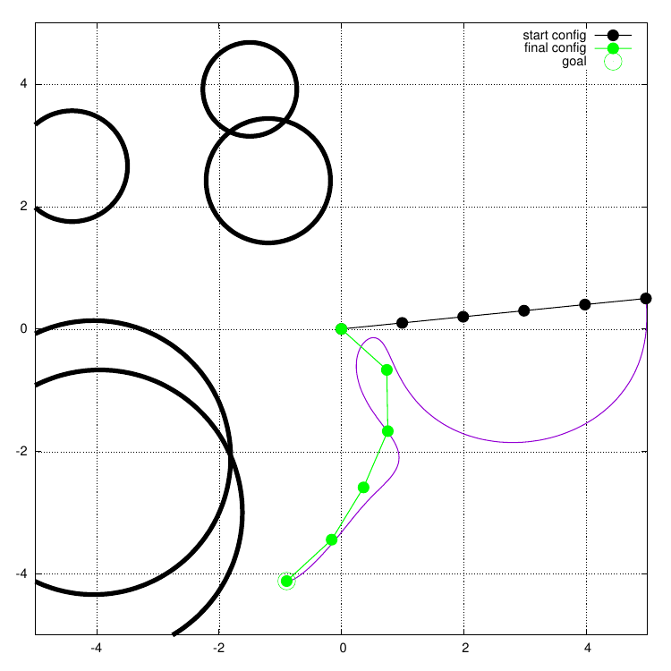

# Experiments for paper

All experiments related to the dynamic fabrics paper should be here.
This repository depends on the dynamic fabrics library (and not much else!).

## ToDo's
Beside the obvious, some things need to be changed/added?
* Fabrics tend to produce 'nan' values if they are close to the goal for a long time.
  - solved by correcting small values to zeros in fabric planner
* Self-collision avoidance
  - done for fabrics by introducing additional geometries
  - still missing for MPC
* Postprocessing for
  - path length
  - clearance
* Multi test script
* Dynamic degrees of freedom during post processing
  - Done by adding argument to createPlot script
* Joint limits for fabrics (needed to have a fair comparision)
  - Done according to paper "Optimization fabrics"
* Variable joint limits for mpc
  - Done using additional inequality constraints (consider using different slack
    variabeles)

## Metrics

Local motion planning are assessed based on
* Planning Time: How long does it take to solve the local planning problem?
* Success Rate: Which percantage of cases lead to reaching the goal?
* Path Length: How long is the path taken?
* Clearance: How far away from obstacles does the robot stay? (How fast does it move close
  to them?)
* (Smoothness): ???

## Experiment 1: Fabric vs MPC

The first experiment should highlight the computational advantage of fabrics over model
predictive control.

### a) point mass

  

### b) planar robotic arm(s)

  

  

### c) real robotic arm

  

### d) real mobile manipulator(s)

## Experiment 2: Static Fabric vs Dynamic Fabric

Proof the practical need for dynamic fabrics as they integrate global planning

## Experiment 3: Moving obstacles (Dynamic Fabric vs MPC)

## Experiment 4: Application to (non-)holonomc bases

## Experiment 5: Application to multi-arm systems
