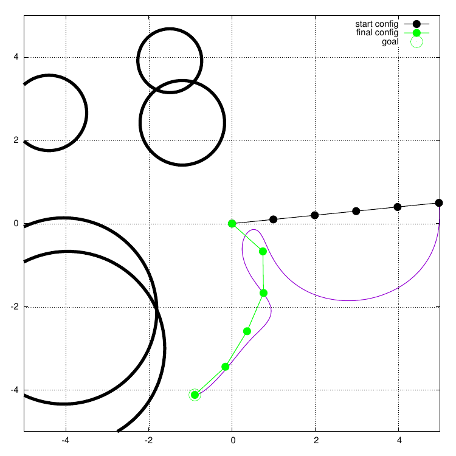
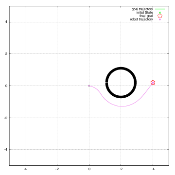
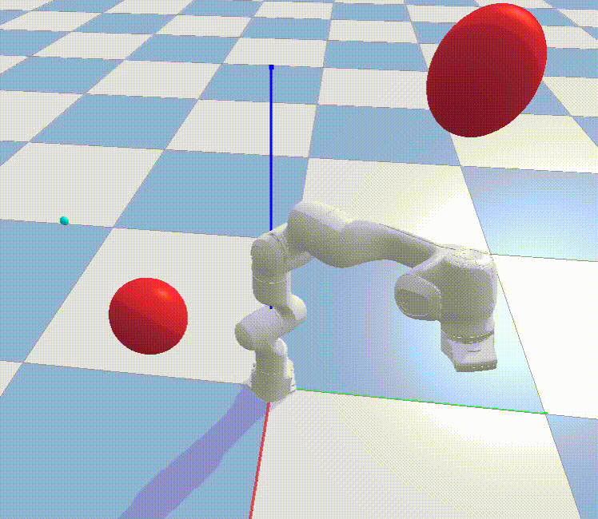
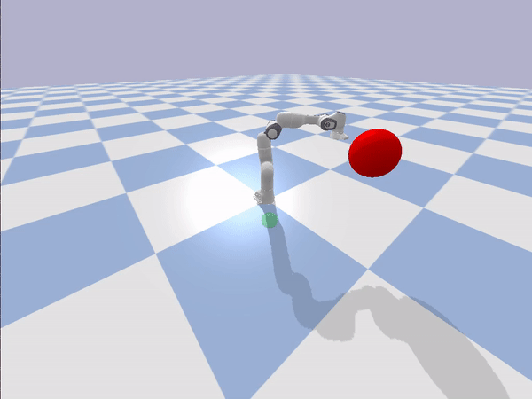
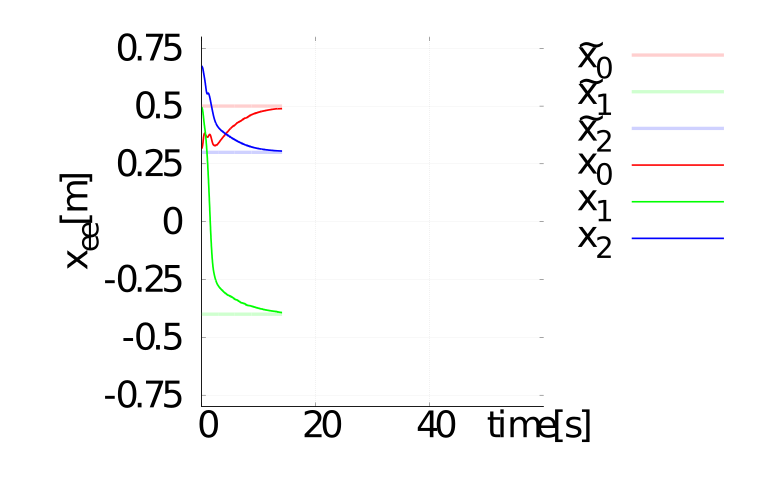

Local Motion Planning Benchmark Suite
=====================================

This repository is meant to allow quick comparison between different
local motion planning algorithms. Running and postprocessing is
available and we aim to offer a nice interface to implement a wrapper to
your own motion planner.

Screenshots
-----------

<table>
 <tr>
  <td> Trajectory planar arm</td>
  <td> Trajectory point robot</td>
  <td> Simulation panda arm</td>
 </tr>
 <tr>
  <td>  </td>
  <td>  </td>  
  <td>  </td>  
 </tr>
</table>
<table>
 <tr>
  <td> Evaluation of series</td>
 </tr>
 <tr>
  <td>  </td>
 </tr>
</table>

Getting started
===============

This is the guide to quickly get going with the local motion planning
benchmark suite.

Pre-requisites
--------------

-   Linux Ubuntu LTS &gt;= 18.04
-   Python &gt;3.6, &lt; 3.10
-   pip3
-   gnuplot (`sudo apt install gnuplot`)
-   \[Optional\] [poetry](https://python-poetry.org/docs/)
-   \[Optional\] [embotech forces
    pro](https://www.embotech.com/products/forcespro/overview/) for mpc
-   \[Optional\] [acados_template](https://github.com/acados/acados/tree/master/interfaces/acados_template) for mpc

Installation
------------

You first have to download the repository

``` {.sourceCode .bash}
git clone git@github.com:maxspahn/localPlannerBench.git
```

Then, you can install the package using pip as:

``` {.sourceCode .bash}
pip3 install .
```

Optional: Installation with poetry
----------------------------------

If you want to use [poetry](https://python-poetry.org/docs/), you have
to install it first. See their webpage for instructions
[docs](https://python-poetry.org/docs/). Once poetry is installed, you
can install the virtual environment with the following commands. Note
that during the first installation `poetry update` takes up to 300 secs.

``` {.sourceCode .bash}
poetry update
poetry install
```

The virtual environment is entered by

``` {.sourceCode .bash}
poetry shell
```

Tutorial
--------

### Simple

The following is a very simple example case containing a point mass robot and a PD planner.

Run an experiments:

Experiments should be added in separate folder in `examples`. One
very simple example can be found in this folder. Note that you need to
active your poetry shell if you have installed the package using poetry
by

``` {.sourceCode .bash}
poetry shell
```

> Or alternatively active your virtual python environment

Then you navigate there by

``` {.sourceCode .bash}
cd examples/point_robot
```

Then the experiment is run with the command line interface

``` {.sourceCode .bash}
runner -c setup/exp.yaml -p setup/pdplanner.yaml --render
```

Postprocessing:

The experiments can be postprocessed using the provide executable. Again make sure you are in the virtual environment, when
using poetry run: 
(`poetry shell`)

``` {.sourceCode .bash}
cd examples/point_robot
```

The you can run the post processor with arguments as

``` {.sourceCode .bash}
post_process --exp path/to/experiment -k time2Goal pathLength --plot
```


### Advanced

To showcase the power of localPlannerBench we would also like to show you a more complex example, containing the 7-DoF frankaemika panda robot arm and a custom opensource [acados](https://github.com/acados/acados) based MPC planner.

Again make sure you are in your virtual python environment.
``` {.sourceCode .bash}
poetry shell
```

Install [acados_template](https://github.com/acados/acados/tree/master/interfaces/acados_template) inside of the virtual environment if you haven't already.

Then you navigate to 

``` {.sourceCode .bash}
cd examples/panda_arm
```

Then the experiment is run with the command line interface

``` {.sourceCode .bash}
runner -c setup/exp.yaml -p setup/acados_mpc.yaml --render
```



The you can run the post processor with arguments as

``` {.sourceCode .bash}
post_process --exp results --latest -k time2Goal pathLength --plot
```




