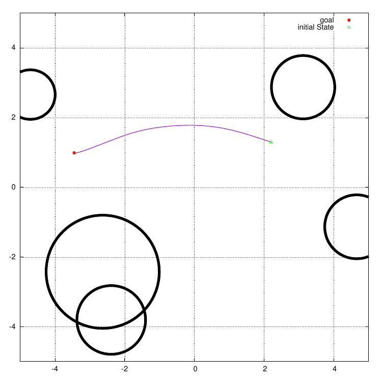

# Experiments for paper

All experiments related to the dynamic fabrics paper should be here.
This repository depends on the dynamic fabrics library (and not much else!).

## Experiment 1

The first experiment should highlight the computational advantage of fabrics over model
predictive control.

### point mass

  

### planar robotic arm(s)
### real robotic arm
### real mobile manipulator(s)

