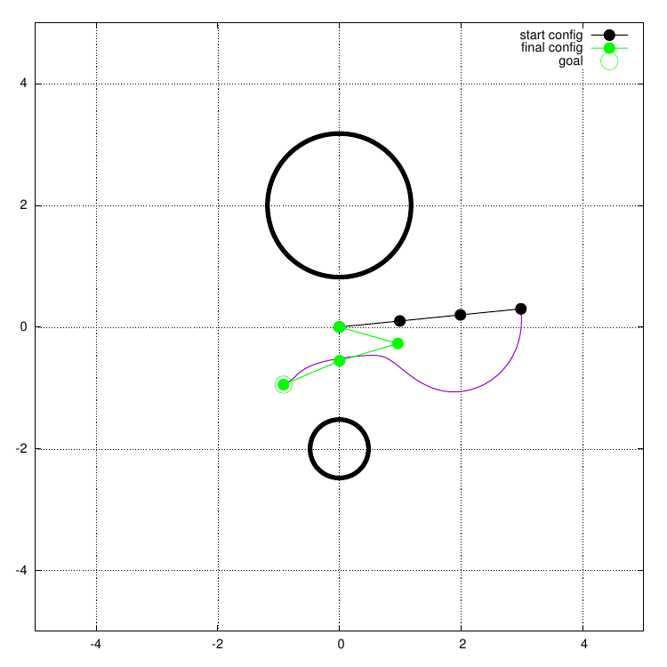

Local Motion Planning Benchmark Suite
=====================================

This repository is meant to allow quick comparison between different
local motion planning algorithms. Running and postprocessing is
available and we aim to offer a nice interface to implement a wrapper to
your own motion planner.

Screenshots
--------------

.. image:: img/trajectory_planar_arm.png
    :width: 70%
    :align: center
    :alt: Example trajectory

.. image:: img/trajectory_point_robot.png
    :width: 70%
    :align: center
    :alt: Example trajectory

.. image:: img/results_comparison.png
    :width: 70%
    :align: center
    :alt: Example trajectory
