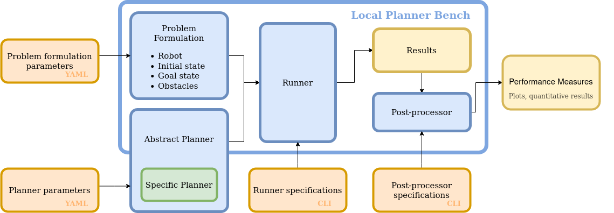

Structure 
=====================================

This repository provides essentially two executables to 

1. Run an experiment
2. Postprocess the results of an experiment.

The users are able to provide their own planner and compare it with the provided
executables.

Here, the underlying structure is explained so that additional planners and metrics can be
easily added.

Overview
------------

Experiment
--------------

The `experiment` sets all the parameters of the experiment, such as time step, robottype,
etc. It also parses the configuration file of the experiment, typically `exp.yaml`. This
configuration file contains the scene, that means the goal, obstacles and other
constraints to the motion planning problem. Objects are taken from `Motion
Planning Scenes <https://github.com/maxspahn/motion_planning_scenes>`_.

Planner
--------------

The `AbstractPlanner` provides a blueprint for local motion planners that every planner
must inherit from. It also sets some abstract methods, which must be provided by any
planner. 

Runner
---------------

Both components are combined in the `runner`. It passes necessary information from the
experiment to the runner, such as obstacles and goals. It also initiates the simulation
environment and enables or disables the `logger`.

Logger
---------------

The `logger` tracks the entire experiment at runtime and produces a summary of the run in
a time-stamped folder. For each run, a new folder with the name 'plannerName_timeStamp' is
created. In there, you will find a csv-file with all the important results, such as taken
action, robot state information, goal positions, obstacles position and planning times.

PostProcessing
---------------

Using the results folder created by the `logger`, the `postProcessor` allows to evaluate
the metrics and create plots to eventually evaluate the performance of an individual
local motion planner.

